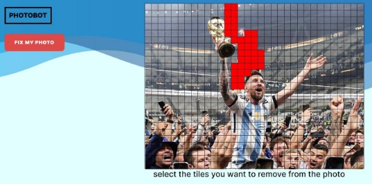
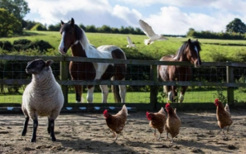
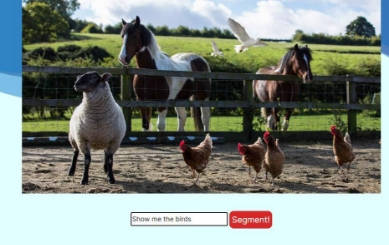

LINK : https://roipapo.github.io/intelegance_systems_project/
 in any case clicking the photobot icon on the top left will return you to the Gallery - landing page

Gallery - landing page: gallery page functionalities:

- The user should be able to upload photos - 

this should keep track of the usage History- any edit he makes should be saved in a real product (not supported in prototype) 

- Clicking on a photo will open view mode with 3 buttons on the top right: 

|Edit page: ||
| - | :- |
|||
|||
|||
|||
|￿  In this screen you will pick between our 2 main components Segmentation and ||
||
|||
|Fix my photo: ||
|Note: in order to see the functionality, you will have to pick this photo:||
|||
|||
|||
|this is just a prototype so we chose to make a local support ||
|||
|In this page you will see a grid of tiles, you can mark down the player from the back that ||
|photo bomb’s Messi’s legendary photo. after marking the tiles with your cursor as you can ||
|see here: ||
|||
|||
|||
|||
|||
|||
|||

press: **Fix my photo.** 

Segmentation: 

Note: in order to see the functionality you will have to pick this photo:

this is just a prototype so we chose to make a local support 

In the middle of the screen you may find an input and a button. 

the prototype should demonstrate classification-segmentation through textual commands enter the following text: “Show me the birds” as you can see in the next photo and click 

